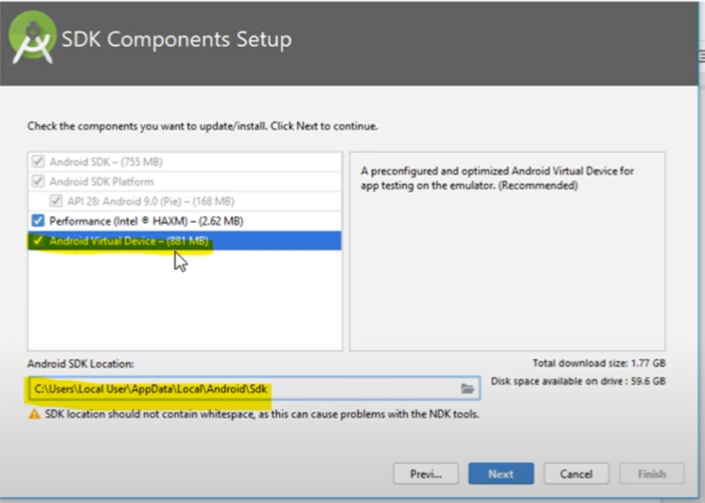
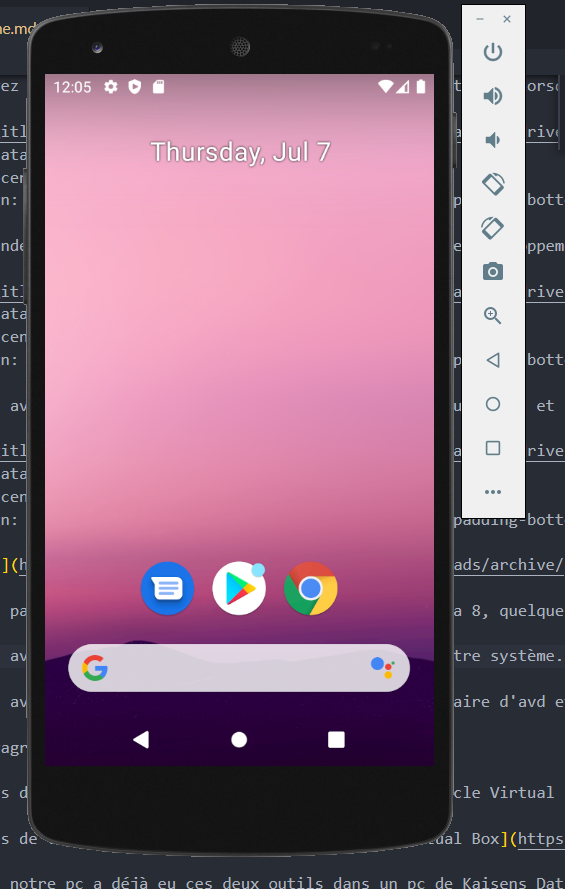

### Guide pour l'installation de Appium.io
=====================
### Author : Med Ali BEN EL HAJ AISSA


## Table of Contents
  - [Android Studio](#Android Studio)
  - [BlueStacks](#BlueStacks)
  - [Intallation Appium](#Installation-appium)
  - [Appium Configuration](#Appium-Configuration)

#### Android Studio

La première chose que vous voulez faire est télécharger android studio, c'est très utile si vous voulez utiliser un émulateur ou autre pour ne pas avoir à utiliser votre téléphone physique

- [Télécharger android studio ](https://developer.android.com/studio#Other)

- Installez android studio 

Pour cette fenêtre, cochez la case android virtual Device si elle n'est pas déjà cochée.


Puis on va choisir le type de setup standard.


Pour le SDK Components Setup, on doit cocher la dérniére option.



Une fois tout est términer on ouvre android studio 


Nous créons un projet simple puisque nous n'avons pas besoin du projet lui-même.


En général, tout se passe sans problème jusqu'à présent.

* Si pour une raison quelconque vous n'êtes pas en mesure de télécharger le sdk android à partir de ça ce qui est également un autre dossier du projet que vous devez télécharger

- [Télécharger SDK Platform Tools ](https://developer.android.com/studio/releases/platform-tools)

* Si nous allons à l'endroit où nous avons installé android studio, nous trouvons le androidSDK où nous avons plusieurs dossiers mais ceux dont nous avons besoin sont "tools", "build-tools" et "platform-tools".


* Ensuite, vous devez spécifier vos variables d'environnement de sorte que lorsque python exécute ses commandes ou lorsque n'importe quel programme java exécute sa commande, il regarde votre chemin d'accès et vérifie ensuite ce que votre chemin d'accès est également spécifié afin qu'il sache où chercher.

Pot cela :
Ouvrez le Panneau de configuration.
Cliquez sur Système et sécurité, puis sur Système
Cliquez sur Paramètres système avancés sur la gauche
Dans la fenêtre Propriétés du système, cliquez sur le bouton Variables d'environnement....


dans cmd, une commande très courante utilisée dans l'environnement de développement d'android est adb


* Une fois que nous avons android studio ouvrez le. ouvrez un nouveau projet et le gestionnaire d'avd sera probablement en haut à droite


- [Télécharger jre ](https://www.oracle.com/java/technologies/downloads/archive/)

Donc vous ne voulez pas java se, vous voulez quelque chose comme java 8, quelque part dans cette ligne.

* Une fois que vous avez fait cela, vous devez installer java sur votre système.

* une fois que vous avez fait cela vous voulez ouvrir votre gestionnaire d'avd et vous voulez créer un nouveau dispositif virtuel ( dans mon cas j'ai testé avec pixel 2 et Nexus 5) avec play store disponible



#### BlueStacks

L'émulateur d'Android Studio consomme beaucoup de RAM et ralentit également le PC. Donc, le mieux est d'utiliser BlueStacks comme émulateur dans android studio ainsi que dans VS Code.

- [ télécharger BlueStacks ](https://www.bluestacks.com/download.html)

- Installez BlueStacks 

Une fois BlueStacks installé, on l'ouvre 


- Étapes pour connecter Bluestacks à Android Studio ou VS Code ou appium.

Étape 1 : - Activez Android Debug Bridge (ADB) dans BlueStacks :
    - Allez dans Paramètres / Préférences et faites défiler vers le bas jusqu'à la fin et vous trouverez l'option ADB. Activez-la. Voir la capture d'écran ci-dessous.


Remarque :
- Démarrez et laissez BlueStacks en marche avant d'exécuter la commande ci-dessous, sinon il ne pourra pas se connecter au port 5555.

Étape 2 :
- Allez dans CMD : ouvrez l'invite de commande ou le terminal et exécutez la commande ci-dessous.

```
$adb connect localhost:5555
```
Remarque :
- le port 5555 change d'une instance a un autre.

Après avoir exécuté la commande, il est indiqué que la connexion à localhost:5555 est réussie.

Étape 3 : 
- Ouvrez maintenant votre Android Studio ou VS Code, il montre un appareil déjà connecté. Maintenant, exécutez votre application directement à BlueStacks.

on peut tester avec la comande 

```
$adb devices
```


#### Installation-appium

- [ télécharger appium server gui ](https://github.com/appium/appium-desktop/releases/tag/v1.22.3-4)

- [ télécharger appium inspector  ](https://github.com/appium/appium-inspector/releases)

Installez appium server gui et vous devez aussi installer appium inspector maintenant toutes les versions qui étaient combinées mais dans les nouvelles versions elles sont séparées.
Alors cet inspecteur vous permet de voir les tags tels qu'ils sont dans le l'appareil pour que vous sachiez sur quoi cliquer

* avant de faire fonctionner quoi que ce soit, vous devez modifier les configurations :
on doit spécifier le java jre que l'on a installé et le sdk que j'ai spécifié qui était le même dans les studios android. 


* Maintenant, une autre chose que vous devez garder à l'esprit mind is the host so the host va généralement être votre adresse IP locale ou pour votre machine hôte qui est généralement 127.0.0.1 et vous écoutez sur le port 4723 à moins que ce pool soit spécifié par une autre application c'est peu probable mais vous voudrez probablement l'utiliser


#### Appium Configuration

* Une autre chose que vous voulez spécifier dans votre inspecteur appium /wd/hub/ qui spécifie juste un point particulier particulier que vous pointez quand vous cherchez des choses sur l'appareil mobile


* Vous pouvez spécifier les capacités ici pour qu'elles soient associées à des paramètres :
"PlatformName" vous pouvez voir ici la valeur "android"

"PlatformVersion" qui serait de huit 

"DeviceName" : "android"

vous pouvez voir à peu près tout ici

Pour plus d'informations, visitez [https://appium.io/docs/en/writing-running-appium/caps/](https://appium.io/docs/en/writing-running-appium/caps/)

* Si vous n'arrivez pas à obtenir votre nom réel de votre appareil android alors ce que vous pouvez faire est d'ouvrir le cmd

```
$adb devices
```
et vous pouvez voir ici le dispositif que vous avez attaché.


Maintenant ce que vous voulez faire c'est démarrer une session après avoir démarré le serveur.


vous pouvez donc voir que nous avons ici un instantané de ce à quoi ressemble l'écran actuel par rapport à la paire et vous pouvez voir que chacun de ces éléments a certaines caractéristiques, donc il a un id de messages, il a un x de ceci et puis d'autres certains paramètres
